<h1 align="center">RENT CAR</h1>

## Free Class 

Rancang Bangun Aplikasi dari Sebuah Masalah

<a href="https://discord.gg/2J58QJmb">Discord</a>

17 oktober 2022 - 26 oktober 2022
jam : 19:00 wita - 21:00 WITA

* Memecahkan suatu masalah (17 Oktober)
* Mendisain rancangan (18 Oktober)
* Plant UML Usecase Diagram & Activity Diagram  (19 Oktober)
* Plant UML ERD  (20 Oktober)
* Balsamiq Mockup  (21 Oktober)
* New Web Project ASP.NET Core  (22 Oktober)
* Database Migration  (23 Oktober)
* MVC  (24 Oktober)
* Testing  (25 Oktober)
* Publish  (26 Oktober)

<!-- TABLE OF CONTENTS -->

  
Daftar isi

  <ol>
    <li><a href="#latar-belakang">Latar Belakang</a></li>
    <li><a href="#masalah-yang-dihadapi">Masalah yang dihadapi</a></li>
    <li><a href="#solusi">Solusi</a></li>
    <li><a href="#batasan-masalah">Batasan Masalah</a></li>
    <li><a href="#usecase-diagram">Usecase Diagram</a></li>
    <li>
      <a href="#activity-diagram">Activity Diagram</a>
      <ul>
        <li><a href="#menitipkan-kendaraan">Menitipkan Kendaraan</a></li>
        <li><a href="#melihat-laporan-kendaraan">Melihat Laporan Kendaraan</a></li>
        <li><a href="#mengelola-kondisi-kendaraan">Mengelola Kondisi Kendaraan</a></li>
        <li><a href="#melihat-ketersediaan-kendaraan">Melihat Ketersediaan Kendaraan</a></li>
        <li><a href="#menyewa-kendaraan">Menyewa Kendaraan</a></li>
        <li><a href="#melihat-laporan-omset">Melihat Laporan Omset</a></li>
      </ul>
    </li>
    <li><a href="#entity-relationship-diagram">Entity Relationship Diagram</a></li>
    <li>
      <a href="#mockup">Mockup Diagram</a>
      <ul>
        <li><a href="#login-page">Login Page</a></li>
        <li><a href="#register-page">Register Page</a></li>
        <li><a href="#home-page">Home Page</a></li>
        <li><a href="#sewa-baru-page">Sewa Baru Page</a></li>
        <li><a href="#upload-bukti-pembayaran-page">Upload Bukti Pembayaran Page</a></li>
        <li><a href="#daftar-sewa-page">Daftar Sewa Page</a></li>
        <li><a href="#detail-sewa-page">Detail Sewa Page</a></li>
      </ul>
    </li>
  </ol>

## Latar Belakang

Rent Car adalah suatu unit usaha di bidang jasa penyewaan kendaraan motor maupun mobil. 
vendor atau pemilik mobil dapat menitipkan kendaraannya untuk disewakan.

adapun alur dari proses penyewaan kendaraan sebagai berikut.

* vendor dapat menitipkan kendaraannya
* custusmer telpon / datang ke kantor untuk memesan kendaraan
* melakukan diskusi harga dan tanggal yang diinginkan
* mencetak surat perjanjian dan di tandatangani
* melakukan pembayaran dp / langsung lunas
* admin melihat kelengkapan dan kesiapan kendaraan
* kendaraan di foto kemudian di serahkan ke customer dan menitipkan tanda pengenal
* kemungkinan perpanjang sewa bisa terjadi
* pengembalian kendaraan oleh customer
* pengecekan dan memfoto kondisi kendaraan
* pelunasan biaya / biaya tambahan bisa terjadi
* pengembalian tanda pengenal

## Masalah Yang Dihadapi

* customer tidak bisa mengubungi saat jam tutup
* ketersediaan kendaraan yang sulit di ketahui
* sering lupa harga sewa setiap kendaraan
* catatan yang menumpuk sering hilang
* 1 kendaraan disewa lebih dari 2 orang di waktu yang sama
* foto kebanyakan, susah di cari
* rekam omset sulit dilakukan
* vendor tidak tau keadalan mobil

## Solusi

* adanya system berbasis website untuk customer agar bisa melihat ketersediaan kendaraan dan melakukan pemesan
* adanya system untuk mengelola data kendaraan dan pemesanan
* adanya system berbasis website untuk vendor adar bisa melihat kondisi kendaraannya

## Batasan Masalah

* aplikasi ini hanya berbasis website
* aplikasi ini mengunakan freamework asp.net core
* aplikasi ini berbasis database dengan sql server 2008 r2
* mengeloa data kendaraan dan penyewaan hanya oleh admin
* vendor hanya dapat melihat kondisi kendaraan
* customer hanya dapat melihat kendaraan yang tersedia dan melakukan penyewaan
* customer hanya dapat pemesanan online dengan mengisi identitas diri secara lengkap
* data online valid jika sudah pembayaran dp
* aplikasi ini hanya mencetak surat perjanjian sesuai inputan
* aplikasi ini hanya dapat menyimpan foto keadaan mobil
* aplikasi ini hanya mencatat pembayaran
* aplikasi ini hanya dapat menghasilkan laporan omset, laporan sewa dan laporan kondisi mobil

## Usecase Diagram

## Activity Diagram

### Menitipkan Kendaraan

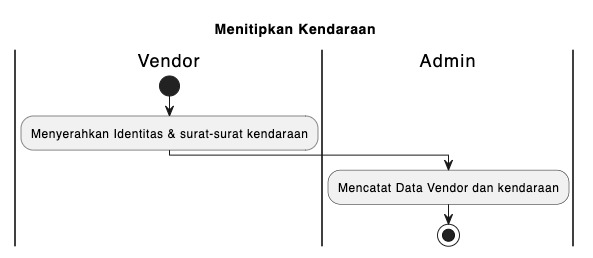

### Melihat Laporan Kendaraan

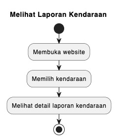

### Mengelola Kondisi Kendaraan

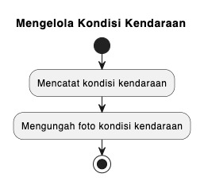

### Melihat Ketersediaan Kendaraan

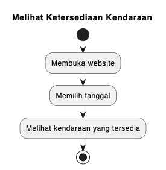

### Menyewa Kendaraan

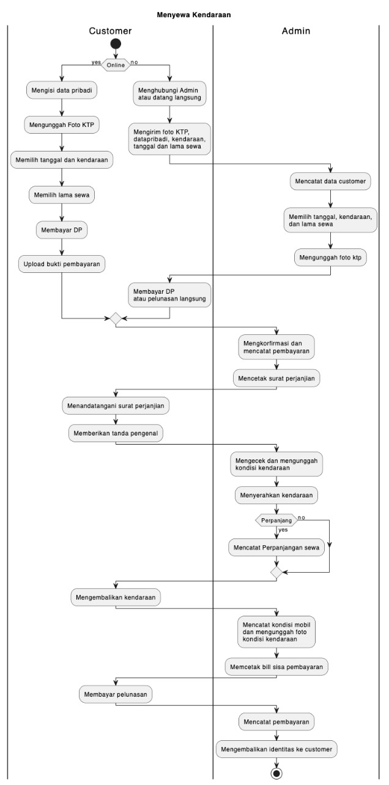

### Melihat Laporan Omset

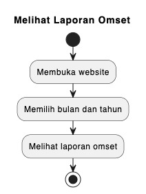

### Entity Relationship Diagram

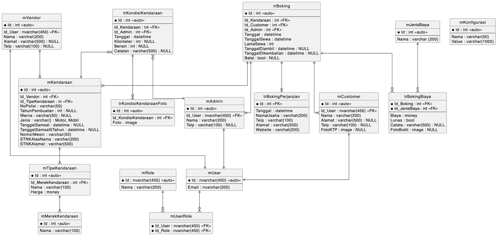

## Mockup

### Login Page

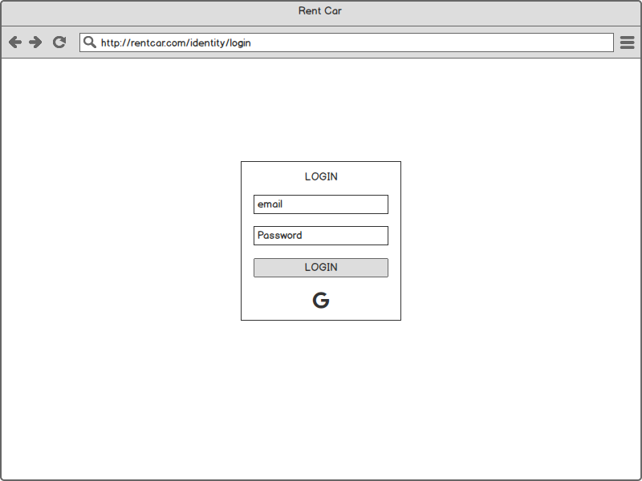

### Register Page

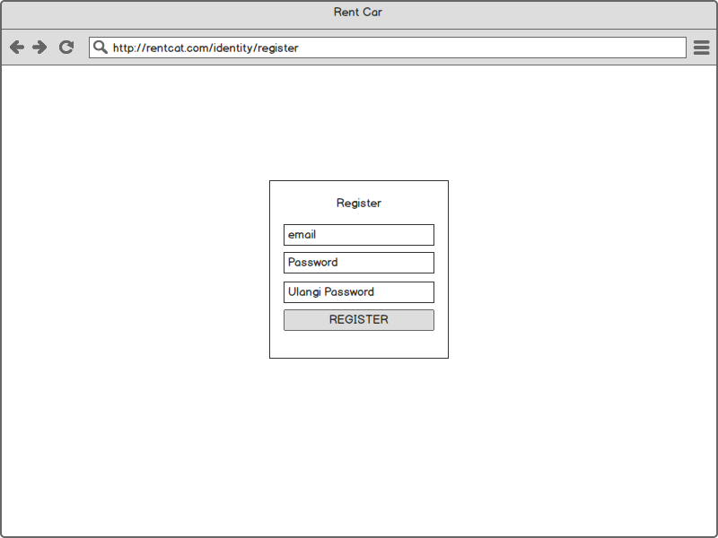

### Home Page

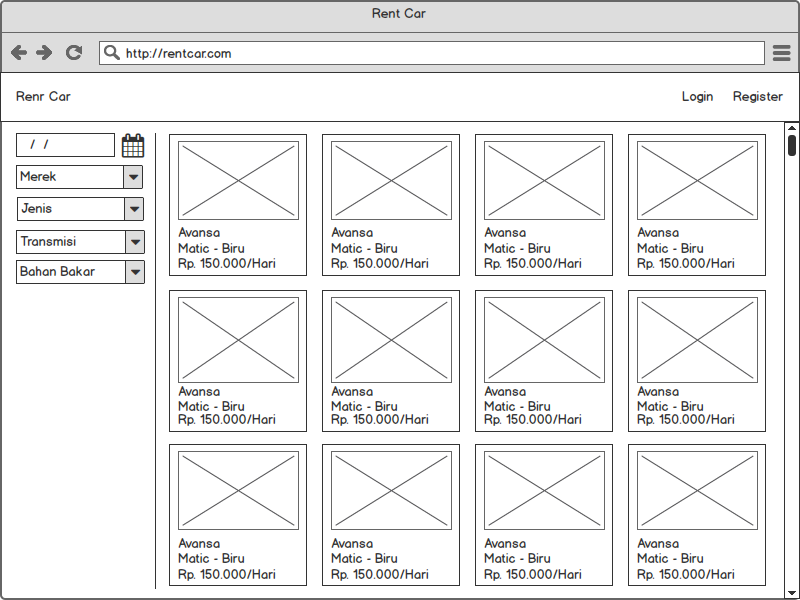

### Sewa Baru Page

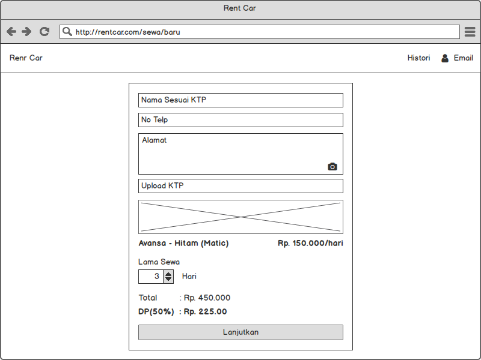

### Upload Bukti Pembayaran Page

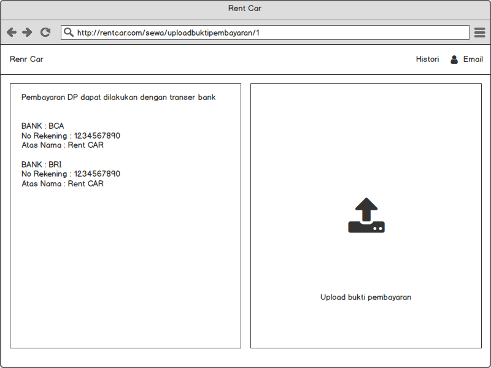

### Daftar Sewa Page

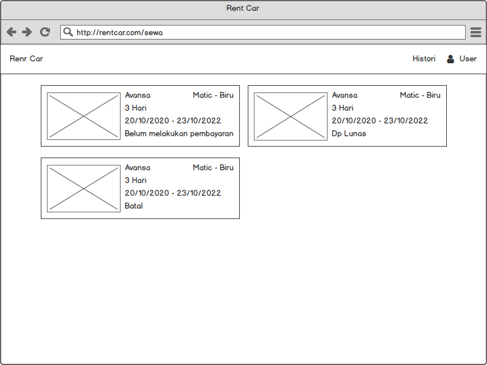

### Detail Sewa Page

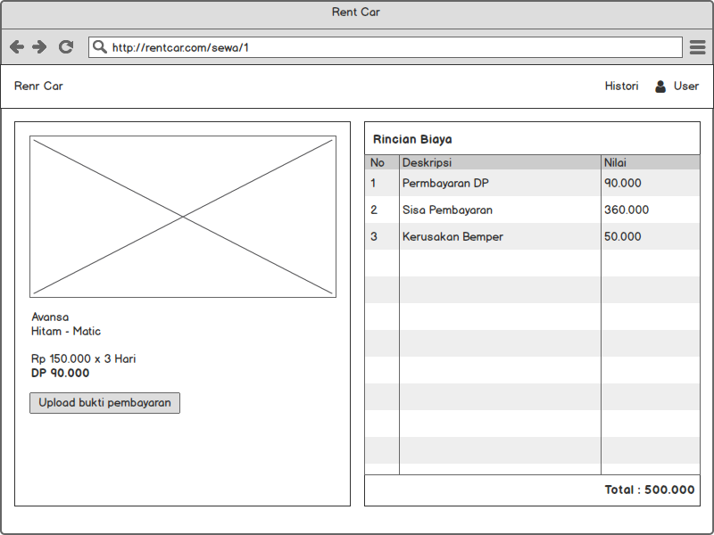
